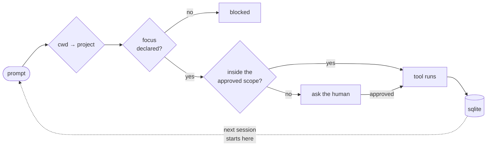

<h1>Pablo Peraza</h1>

**I build the scaffolding that makes AI coding agents accountable.**
Memory that survives the session. Gates that refuse the destructive call. Contracts a model can't talk its way out of.

Rust and TypeScript, from Yucatán, México.

---

### The problem I work on

An agent forgets everything between sessions, and nothing stops it from doing damage in the meantime. So I built the layer underneath: every tool call has to pass through it, and everything worth remembering gets written down.

Same core, three clients: **Claude Code**, **opencode**, **oh-my-pi**. The adapters only translate protocol — every decision lives in one place, so a fix reaches all three.

---

## I · Agent infrastructure

<table>
<tr><td width="50%" valign="top">

### [building_mem](https://github.com/perazapablo/building_mem)
`Rust` · `SQLite` · `Tauri` · `Angular`

An MCP server that gives agents a memory with rules. 36 tools over stdio, FTS5 search, token-aware context assembly, 14 versioned migrations, 178 tests.

Decisions are append-only chains: revising one means reading what it replaces first — you can't overwrite what you haven't read. Writes stamp `project_id` and `session_id` from harness state and **strip those keys from the schema**, so the model can't lie about where it's writing.

Ships with a desktop viewer for reading it all back.

</td><td width="50%" valign="top">

### [agent-rules](https://github.com/perazapablo/agent-rules)
`JavaScript` · `hooks`

The rules themselves, and the hooks that enforce them.

Some are text the model can ignore. The ones that matter are code: catastrophic commands hard-denied, writes gated on a declared focus, test runners blocked from pointing at a non-local database.

Each rule declares what enforces it, so it's obvious which ones are real.

</td></tr>
</table>

---

## II · Production systems

Seven months of daily work at **PC Oriente Desarrollos**, building and maintaining the systems behind **Purifreze** (water treatment services) and PC Oriente's own operation.

| System | What it does | Stack | My commits |
|---|---|---|---|
| `pcoriente-admin` | Company-wide admin platform | Angular 15 standalone | **188** |
| `server-pco-new` | Backend and API behind it | TypeScript · Node | **117** |
| `admin-purifreze` | Operations panel: services, charges, equipment | Angular · TypeScript | **79** |
| `server-admin-purifreze` | Its backend | TypeScript · Node | **63** |
| [`landing_page_Purifreze`](https://github.com/pcorientedesarrollos/landing_page_Purifreze) | Public site | Astro | 32 |
| [`purifreze_admin_cms`](https://github.com/pcorientedesarrollos/purifreze_admin_cms_Frontend) | CMS, [front](https://github.com/pcorientedesarrollos/purifreze_admin_cms_Frontend) + [back](https://github.com/pcorientedesarrollos/purifreze_admin_cms_Backend) | Angular · TypeScript | 26 |
| [`puri-movil`](https://github.com/pcorientedesarrollos/puri-movil) | Field app for technicians | React Native · Expo | 5 |

The first four are private, so the links stop there. The work doesn't: auth moved off MD5 onto bcrypt, credentials pulled out of version control, a backend taken to v2.0.0 — the unglamorous half of keeping something running.

---

## Stack

|  |  |
|---|---|
| **Daily** | TypeScript · Angular · Node · SQL |
| **Where it gets interesting** | Rust · SQLite (FTS5, WAL, migrations) · MCP |
| **Also shipped** | React Native · Expo · Astro · Laravel |
| **Tools** | Linux · Hyprland · git · Claude Code · opencode |

---

## Now

Porting the harness to a fourth client, and teaching the memory server to answer *"what was I doing here?"* instead of just *"what do I know?"* — a session's focus used to be one row that each declaration overwrote, so a two-hour session left a single line. It's a log now.

Digital Business & Virtual Environments student. 19.

<a href="https://github.com/perazapablo?tab=repositories">All repositories</a> · Commit counts are what GitHub attributes to this account.
